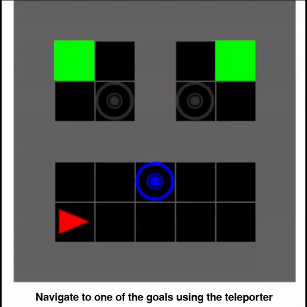

# stochastic-minigrid
Stochastic environments in the MiniGrid domain.

The below example shows the Teleporter5by5 environment, in which the teleporter takes the agent to two possible destinations, each with a 50% likelihood:

  

Run the `example.py` script to open an interactive environment with a player-controlled agent.

# Requirements
- Python $\geq$ 3.7
- `minigrid` package.

# Acknowledgements
This builds heavily on the MiniGrid task suite by the Farama Foundation (see [here](https://minigrid.farama.org/environments/minigrid/)).

